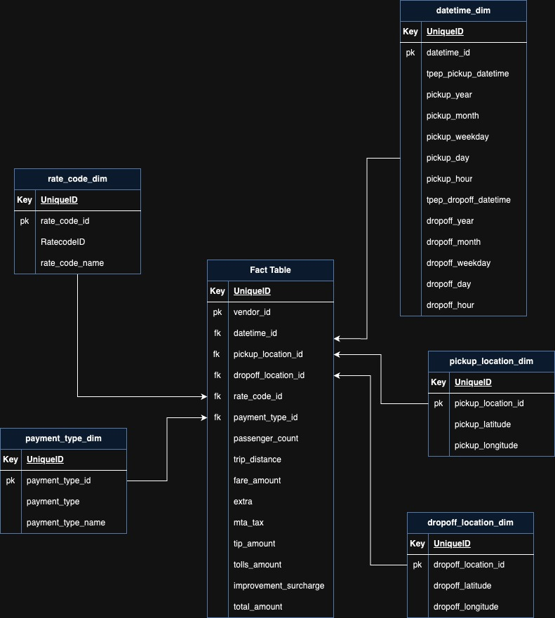

# NYC Uber Rides ETL Pipeline Project

## Introduction

Welcome to the NYC Uber Rides ETL Pipeline Project!

This project aims to build an end-to-end ETL (Extract, Transform, Load) pipeline for analyzing Uber ride data from New York City. The data architecture leverages various Google Cloud Platform (GCP) services to handle and process large datasets efficiently, culminating in a comprehensive data visualization dashboard using Looker Studio.

### Background and Motivation

During my time at university, Uber was my primary mode of transportation, and I developed a keen interest in understanding and analyzing ride data. While I initially sought to focus on Uber ride data from the Bay Area in California, I encountered challenges finding accessible datasets for that region. As a result, I shifted my focus to the extensive and publicly available Uber ride data from New York City.

### Project Overview

This project involves several key steps:

1. **Data Collection**: Raw Uber ride data is collected from the [NYC Taxi & Limousine Commission (TLC) website](https://home.nyc.gov/site/tlc/about/tlc-trip-record-data.page) and stored in Google Cloud Storage.

2. **ETL Pipeline**: Using Mage, an ETL tool, we process and transform the raw data on Google Cloud Compute. This transformation involves cleaning, aggregating, and structuring the data to make it suitable for analysis.

3. **Data Storage**: The transformed data is then loaded into Google BigQuery, a powerful data warehousing solution that enables efficient querying and analysis.

4. **Data Visualization**: Finally, Looker Studio is connected to BigQuery to create interactive dashboards that visualize key metrics and insights from the Uber ride data.

### Objectives

- **Data Processing**: Develop an automated pipeline to handle large-scale datasets, ensuring data quality and consistency.
- **Data Modeling**: Implement effective fact and dimensional modeling techniques to structure the data. This involves designing and creating fact tables and dimension tables that support comprehensive data analysis and reporting.
- **Visualization**: Create an intuitive and interactive dashboard to visualize ride patterns, trends, and other relevant metrics.

This project serves as a demonstration of my ability to design and implement a robust ETL pipeline using cloud technologies, while also showcasing my skills in data modeling and visualization of complex data.

## Data Architecture

The data architecture of this project is designed to efficiently handle and process large volumes of Uber ride data, ensuring that the data is transformed, analyzed, and visualized effectively. Below is an overview of the architecture and the steps involved:

1. **Data Upload**: Raw Uber ride data in CSV format is uploaded to Google Cloud Storage. This provides a scalable and secure location for storing large datasets before processing.

2. **Compute Engine Setup**: A Google Cloud Compute Engine Virtual Machine (VM) instance is created to handle the data processing tasks. This VM will run the ETL pipeline and execute data transformations.

3. **ETL Pipeline with Mage**:
   - **Mage AI**: Mage is an open-source ETL tool that simplifies data workflows by providing a user-friendly interface for designing and executing data pipelines. It supports various data processing tasks, including extraction, transformation, and loading of data. For more information about Mage AI, visit their [website](https://www.mage.ai/).
   - The ETL pipeline is designed to process the raw data, perform necessary transformations, and prepare it for loading into BigQuery.

4. **Data Loading into BigQuery**: The transformed data is loaded into Google BigQuery, a fully-managed data warehouse solution that supports fast SQL queries and scalable data analysis. This step prepares the data for in-depth analysis and reporting.

5. **Analysis and Analytics Table Creation**:
   - Perform data analysis within BigQuery to generate insights from the Uber ride data.
   - Create an analytics table that aggregates and organizes the data for use in visualizations.

6. **Visualization in Looker Studio**:
   - **Looker Studio**: Connect Looker Studio to BigQuery to create interactive and dynamic dashboards. Looker Studio allows users to build and share reports and visualizations that provide insights into the data.

This architecture ensures a seamless flow from data collection to visualization, enabling comprehensive analysis and insightful reporting on Uber ride data from New York City.

## ETL Pipeline

The ETL (Extract, Transform, Load) pipeline for this project is designed to efficiently process and prepare Uber ride data for analysis and visualization. Below is a summary of each stage in the pipeline:

### 1. Extract

In the extraction phase, raw Uber ride data is retrieved from Google Cloud Storage. The data is initially stored in CSV format. The extraction process involves downloading this CSV file from the specified URL and loading it into a DataFrame for further processing.

You can find more detailed steps here: [extract.py](mage-files/extract.py)

### 2. Transform

During the transformation stage, the extracted data is processed and modeled to create meaningful tables. This involves several key steps:

- **Data Modeling**: The data is structured into fact and dimension tables. The fact table captures the core transactional data, while dimensional tables store information related to time, locations, rate codes, and payment types.
  - **Fact Table**: Contains the main transactional records of Uber rides.
  - **Dimension Tables**:
    - `datetime_dim`: Includes details about pickup and dropoff times.
    - `pickup_location_dim`: Contains information about pickup locations.
    - `dropoff_location_dim`: Contains information about dropoff locations.
    - `rate_code_dim`: Describes the rate codes for the rides.
    - `payment_type_dim`: Lists the payment types used for the rides.

Each dimension table is linked to the fact table via foreign keys, enabling comprehensive and structured data analysis.

You can find more detailed steps here: [transform.py](mage-files/transform.py)

### 3. Load

In the loading phase, the transformed data is uploaded into Google BigQuery. The data from the fact and dimension tables is loaded into separate tables in BigQuery, preparing it for detailed analysis and visualization. This step ensures that the data is stored in a format suitable for querying and reporting.

Once the data is in BigQuery, it can be analyzed and used to create reports and dashboards in Looker Studio, providing valuable insights into the Uber ride data.

You can find more detailed steps here: [load.py](mage-files/load.py)

## Dashboard

The final component of the project is the dashboard created using Looker Studio, which is connected to the data stored in Google BigQuery. This interactive dashboard provides a comprehensive view of the Uber ride data with various analytical features and visualizations.

### Key Features

- **Key Metrics**: The dashboard displays several key metrics, including:
  - **Average Trip Distance**: Shows the average distance of Uber trips.
  - **Total Number of Trips**: Provides the total count of Uber trips recorded.
  - **Total Revenue**: Displays the cumulative revenue generated from the rides.
  - **Average Fare Amount**: Represents the average fare amount for trips.
  - **Average Tip Amount**: Shows the average tip given for the rides.

- **Filters**: Users can interact with the dashboard by applying filters to view data based on specific criteria:
  - **Vendor Type**: Filter data according to the Uber vendor type.
  - **Payment Type**: Filter trips based on the method of payment.
  - **Rate Code**: Apply filters to see data for different rate codes.
  - **Trip Distance**: Filter trips by distance to analyze shorter or longer trips.

- **Bubble Map**: An interactive bubble map is included to visualize the geographic distribution of Uber trips. This map allows users to see where trips are being booked across the city, providing spatial insights into ride patterns.

## Conclusion

The dashboard effectively integrates with BigQuery to offer an in-depth analysis of Uber ride data. With its key metrics, interactive filters, and geographical visualizations, it provides valuable insights into ride patterns and financial aspects of the trips. This project demonstrates the power of combining data engineering and visualization tools to analyze and present data in a meaningful way. By leveraging GCP, Mage AI, BigQuery, and Looker Studio, this ETL pipeline and dashboard setup offers a robust solution for exploring and understanding transportation data.

You can find more detailed SQL analysis here: [analysis_queries.py](analysis_queries.sql)

